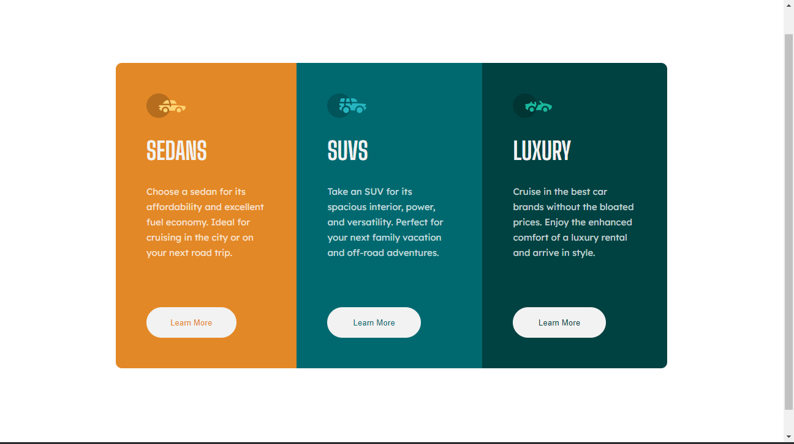

# Frontend Mentor - 3-column preview card component solution

This is a solution to the [3-column preview card component challenge on Frontend Mentor](https://www.frontendmentor.io/challenges/3column-preview-card-component-pH92eAR2-). Frontend Mentor challenges help you improve your coding skills by building realistic projects. 

## Table of contents

- [Overview](#overview)
  - [The challenge](#the-challenge)
  - [Screenshot](#screenshot)
  - [Links](#links)
- [My process](#my-process)
  - [Built with](#built-with)
  - [What I learned](#what-i-learned)
  - [Continued development](#continued-development)
  - [Useful resources](#useful-resources)
- [Author](#author)
- [Acknowledgments](#acknowledgments)

## Overview

### The challenge

Users should be able to:

- View the optimal layout depending on their device's screen size
- See hover states for interactive elements

### Screenshot

### Links

- Solution URL: [Link](https://github.com/leonardlai/frontend-mentor-3-column-preview-card-component-main)
- Live Site URL: [TBA](https://your-live-site-url.com)

## My process

- Wanted to use this challenge as a practice for flexbox concepts
- Created desktop page first, whereas on hindsight - should have created mobile page first.

### Built with

- Semantic HTML5 markup (As much as possible)
- CSS custom properties
- Flexbox

### What I learned

#### css

- Learned by experimenting with card container and manupulating elements within them via flexbox.

### Continued development

- Would probably retry this challenge using React in future. 

### Useful resources

- [www.internetingishard](https://www.internetingishard.com/html-and-css/flexbox/) - Learned Flexbox concepts from this page via the tutorial. This site explanation with tutorial really help me in understanding various flexbox concepts.
- [www.w3schools.com/](https://www.w3schools.com/) - Mainly used this site for quick reference on how to do some stuff. 
- [developer.mozilla.org/](https://developer.mozilla.org/) - Alternative to W3schools.com

## Author

- Frontend Mentor - [@leonardlai](https://www.frontendmentor.io/profile/leonardlai)
